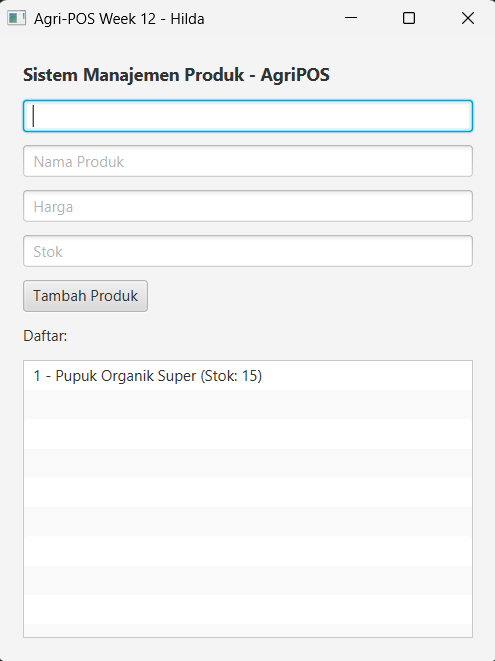

# Laporan Praktikum Minggu 1 (sesuaikan minggu ke berapa?)
Topik: [Implementasi GUI dengan JavaFX dan Koneksi Database PostgreSQL]

## Identitas
- Nama  : [HIlda Sava Alzena]
- NIM   : [240202865]
- Kelas : [3ikra]

---

## Tujuan
Membangun antarmuka pengguna (GUI) menggunakan framework JavaFX.

Mengimplementasikan koneksi antara aplikasi Java dengan database PostgreSQL melalui JDBC.

Menerapkan pola desain DAO (Data Access Object) untuk mengelola data produk (Create dan Read).

---

## Dasar Teori
JavaFX GUI: JavaFX adalah pustaka Java yang digunakan untuk membangun antarmuka pengguna grafis (GUI) yang interaktif, menggantikan library Swing dengan fitur yang lebih modern.

Pola Desain DAO (Data Access Object): DAO adalah pola desain yang memisahkan logika akses database dari logika bisnis aplikasi, sehingga kode menjadi lebih rapi dan mudah dikelola.

JDBC (Java Database Connectivity): JDBC merupakan API standar Java yang memungkinkan aplikasi untuk terhubung dan menjalankan perintah SQL pada database relasional seperti PostgreSQL.

Event Handling: Mekanisme dalam JavaFX untuk menangani interaksi pengguna, seperti menangkap aksi klik pada tombol (Button) untuk menjalankan fungsi tertentu dalam program.

Model-View-Controller (MVC) Sederhana: Pemisahan komponen program menjadi Model (data), View (tampilan), dan Controller (logika) untuk meningkatkan struktur dan kemudahan pengembangan aplikasi.

## Langkah Praktikum
1. Persiapan dan Setup (Setup)

   Membuka folder project agripos-gui menggunakan Visual Studio Code.

   Mengatur file pom.xml untuk memastikan dependensi javafx-controls, javafx-fxml, dan postgresql driver sudah terpasang dengan benar.

   Memastikan database PostgreSQL dengan nama agripos sudah aktif dan memiliki tabel products.

2. Implementasi Kode (Coding)

   Model: Membuat class Product.java di package com.upb.agripos.model untuk menyimpan data produk.

   Config: Membuat DatabaseConfig.java di package com.upb.agripos.config untuk mengatur koneksi ke database menggunakan URL, user, dan password yang sesuai.

   DAO & Service: Mengimplementasikan ProductDAOImpl.java untuk menangani query SQL dan ProductService.java sebagai jembatan logika antara database dan UI.

   View: Membuat file utama AppJavaFX.java di package com.upb.agripos.view untuk membangun tampilan GUI secara manual (tanpa FXML) dan menghubungkan aksi tombol "Tambah Produk" dengan database.

3. Eksekusi Program (Run)

   Menjalankan perintah melalui terminal atau menu Maven: mvn javafx:run.

   Melakukan pengujian dengan menginputkan data produk melalui form GUI, menekan tombol "Tambah", dan memastikan data muncul di ListView.

   Melakukan verifikasi data secara langsung di pgAdmin untuk memastikan data benar-benar tersimpan di tabel database.

4. Dokumentasi dan Versi (Commit)

   Menambahkan semua perubahan file ke area staging menggunakan perintah git add ..

   Melakukan commit untuk menyimpan progress praktikum dengan pesan yang deskriptif.

   Commit message yang digunakan: "Selesai praktikum week 12 - Implementasi GUI JavaFX dan Database".

---

## Kode Program
1. Model Produk (Product.java)
Kode ini mendefinisikan struktur data yang digunakan di seluruh aplikasi.

package com.upb.agripos.model;

public class Product {
    private String id;
    private String name;
    private double price;
    private int stock;

    public Product(String id, String name, double price, int stock) {
        this.id = id;
        this.name = name;
        this.price = price;
        this.stock = stock;
    }

    // Getter untuk akses data
    public String getId() { return id; }
    public String getName() { return name; }
    
    @Override
    public String toString() {
        return id + " - " + name + " (Stok: " + stock + ")";
    }
}
2. Konfigurasi Database (DatabaseConfig.java)
Kode yang mengatur "pintu masuk" koneksi ke PostgreSQL.

package com.upb.agripos.config;
import java.sql.*;

public class DatabaseConfig {
    public static Connection getConnection() throws SQLException {
        String url = "jdbc:postgresql://localhost:5432/agripos";
        String user = "postgres";
        String password = "password_kamu"; // Sesuai settingan lokal
        return DriverManager.getConnection(url, user, password);
    }
}

3. Logika Antarmuka (AppJavaFX.java)
Bagian paling krusial yang menangani klik tombol untuk menyimpan data ke database.

// Contoh pengambilan data dari UI dan penyimpanan ke DB
btnAdd.setOnAction(e -> {
    try {
        // Instansiasi object dari input TextField
        Product p = new Product(
            txtCode.getText(), 
            txtName.getText(), 
            Double.parseDouble(txtPrice.getText()), 
            Integer.parseInt(txtStock.getText())
        );
        
        // Memanggil service untuk INSERT ke PostgreSQL
        service.addProduct(p); 
        
        // Refresh daftar ListView
        listView.getItems().setAll(service.getAllProducts()); 
        
    } catch (Exception ex) {
        ex.printStackTrace();
    }
});

---

## Hasil Eksekusi
(Sertakan screenshot hasil eksekusi program.  

)
---

## Analisis
(
- Jelaskan bagaimana kode berjalan.  
   Program dimulai dari AppJavaFX.java yang menginisialisasi komponen GUI dan memanggil ProductService.

   Saat aplikasi terbuka, program menjalankan fungsi refreshList yang memicu ProductDAO untuk menjalankan query SELECT * FROM products ke database PostgreSQL.

   Ketika pengguna mengisi form dan menekan tombol Tambah Produk, data diambil dari TextField, dibungkus menjadi objek Product, lalu dikirim melalui ProductService ke database menggunakan query INSERT.

   Setelah proses simpan berhasil, aplikasi secara otomatis memanggil ulang data terbaru dari database untuk memperbarui tampilan ListView.

- Apa perbedaan pendekatan minggu ini dibanding minggu sebelumnya. 
   Penyimpanan Data: Pada minggu sebelumnya, data hanya disimpan di memori sementara (ArrayList). Minggu ini, data disimpan secara permanen di database PostgreSQL, sehingga data tidak hilang saat aplikasi ditutup.

   Arsitektur: Pendekatan minggu ini lebih kompleks dengan menerapkan pola DAO (Data Access Object) dan Service Layer untuk memisahkan antara tampilan (GUI) dan akses data (Database).

   Konektivitas: Digunakan library eksternal berupa JDBC Driver untuk menghubungkan bahasa pemrograman Java dengan sistem manajemen database.

- Kendala yang dihadapi dan cara mengatasinya. 
   Kendala: Daftar produk sempat kosong meskipun aplikasi sudah berjalan (Build Success).

   Penyebab: Belum adanya perintah untuk memanggil data dari database saat aplikasi pertama kali dimuat (initial load) dan belum ada data awal di tabel produk.

   Solusi: Menambahkan fungsi loadFromDatabase() di dalam method start pada JavaFX dan melakukan input data manual melalui form atau pgAdmin untuk memastikan koneksi database sudah aktif.

   Kendala Teknis: Kesalahan penulisan password atau URL database pada file DatabaseConfig.java.

   Solusi: Melakukan pengecekan ulang pada kredensial PostgreSQL dan memastikan service PostgreSQL sudah berstatus Running di sistem operasi. 
)
---

## Kesimpulan
Integrasi GUI dan Database Berhasil: Praktikum ini membuktikan bahwa aplikasi berbasis JavaFX dapat dihubungkan secara fungsional dengan database relasional PostgreSQL melalui library JDBC.

Penyimpanan Data Permanen: Perubahan dari penyimpanan data di memori sementara (ArrayList) ke database memungkinkan data produk tetap tersimpan meskipun aplikasi ditutup dan dibuka kembali (persitensi data).

Implementasi Arsitektur yang Baik: Penggunaan pola desain DAO (Data Access Object) dan Service Layer terbukti mempermudah manajemen kode, di mana logika tampilan terpisah dari logika manipulasi data di database.

Efisiensi UI: Penggunaan komponen ListView yang dikombinasikan dengan fungsi refresh otomatis memberikan pengalaman pengguna yang baik karena daftar produk langsung terperbarui setelah proses tambah data dilakukan.
---

