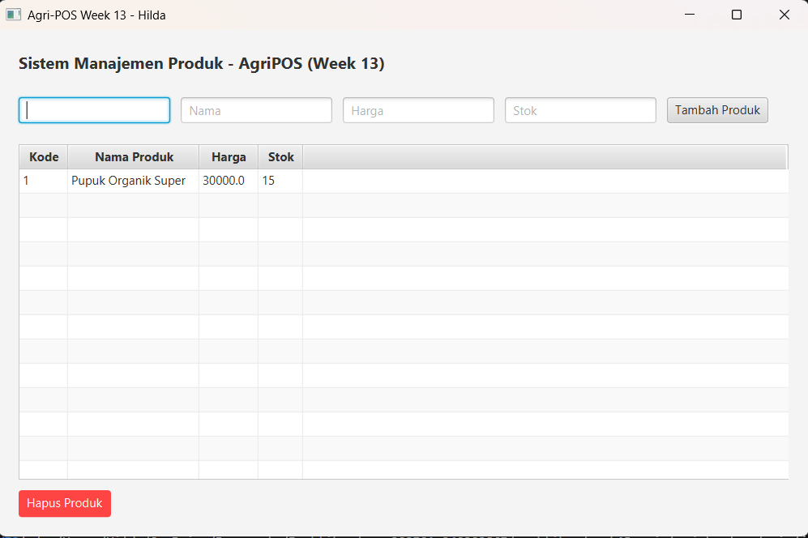

# Laporan Praktikum Minggu 1 (sesuaikan minggu ke berapa?)
Topik: [Implementasi GUI Lanjutan (TableView) dan Operasi Database (Delete) menggunakan Lambda Expression]

## Identitas
- Nama  : [Hilda Sava Alzena]
- NIM   : [240202865]
- Kelas : [3ikra]

---

## Tujuan
Mengganti komponen ListView menjadi TableView untuk menampilkan data secara tabular.

Mengimplementasikan fitur Hapus Data (Delete) dari database melalui antarmuka grafis.

Menggunakan Lambda Expression untuk menangani event handling pada tombol.

Memperdalam arsitektur MVC (Model-View-Controller) pada aplikasi JavaFX.
---

## Dasar Teori
   1. TableView: Merupakan komponen JavaFX yang digunakan untuk menampilkan data dalam bentuk tabel (baris dan kolom). Komponen ini membutuhkan TableColumn dan PropertyValueFactory untuk menghubungkan atribut objek (Model) ke kolom yang ada di layar.

   2. Lambda Expression: Fitur Java yang diperkenalkan sejak Java 8 untuk menyederhanakan penulisan kode, terutama pada functional interfaces. Dalam JavaFX, Lambda digunakan untuk menangani aksi tombol (Event Handling) agar kode lebih ringkas dibandingkan menggunakan Anonymous Inner Class.

   3. Data Access Object (DAO) Pattern: Sebuah pola desain yang memisahkan logika bisnis aplikasi dari logika akses data (database). Hal ini memungkinkan perubahan pada database tidak mengganggu kode program utama.

   4. CRUD (Delete): Operasi Delete adalah bagian dari CRUD yang berfungsi untuk menghapus baris data di database menggunakan perintah SQL DELETE. Penggunaannya harus menggunakan PreparedStatement untuk keamanan data.

   5. Traceability: Alur keterhubungan antar komponen dalam pemrograman berorientasi objek, di mana setiap aksi pada Interface (View) harus dapat ditelusuri perjalanannya hingga ke tingkat Service, DAO, sampai ke Database.

---

## Langkah Praktikum
1. Persiapan dan Setup (Setup)
   Membuka project oop-202501-240202865 di VS Code.

   Memastikan PostgreSQL sudah berjalan dan database agripos siap digunakan.

   Mengarahkan pengerjaan pada folder praktikum/week13-gui-lanjutan.

2. Implementasi Kode (Coding)
   Layer DAO: Menambahkan method delete(String id) pada ProductDAO.java dan mengimplementasikan query SQL DELETE pada ProductDAOImpl.java.

   Layer Service: Menambahkan method deleteProduct(String id) di ProductService.java sebagai jembatan antara View dan DAO.

   Layer View (UI): * Mengubah ListView menjadi TableView pada AppJavaFX.java dan ProductTableView.java.

   Mengatur kolom tabel menggunakan TableColumn dan PropertyValueFactory.

   Menambahkan tombol Hapus dan memberikan logika aksi menggunakan Lambda Expression.

   Launcher: Membuat file Launcher.java sebagai entry point aplikasi agar JavaFX dapat berjalan dengan benar melalui Maven.

3. Eksekusi dan Pengujian (Run)
   Menjalankan aplikasi menggunakan perintah mvn javafx:run melalui panel Maven di sisi kiri VS Code.

   Melakukan uji coba input data produk baru (Create).

   Melakukan uji coba menghapus data yang dipilih dari tabel (Delete).

   Memastikan data pada tabel langsung ter-refresh secara otomatis setelah aksi dilakukan.

4. Penggunaan Git (Commit Message)
   Selama praktikum, dilakukan penyimpanan perubahan dengan pesan commit sebagai berikut:

   git commit -m "feat: implement tableview for product list"

   git commit -m "feat: add delete functionality with lambda expression"

   git commit -m "fix: add launcher class for javafx execution"

---

## Kode Program
1. Implementasi TableView dan Lambda (AppJavaFX.java)
Bagian ini menunjukkan bagaimana tabel dikonfigurasi dan bagaimana tombol hapus bekerja menggunakan ekspresi Lambda.

// Konfigurasi Kolom TableView
TableColumn<Product, String> colCode = new TableColumn<>("Kode");
colCode.setCellValueFactory(new PropertyValueFactory<>("id"));

TableColumn<Product, String> colName = new TableColumn<>("Nama Produk");
colName.setCellValueFactory(new PropertyValueFactory<>("name"));

// Menambahkan data ke Tabel
table.getColumns().addAll(colCode, colName, colPrice, colStock);

// Event Handling Hapus Produk menggunakan Lambda
btnDelete.setOnAction(e -> {
    Product selected = table.getSelectionModel().getSelectedItem();
    if (selected != null) {
        service.deleteProduct(selected.getId()); // Memanggil Service
        loadData.run(); // Refresh Tabel
    } else {
        showAlert("Peringatan", "Pilih produk yang ingin dihapus!");
    }
});

2. Logika Database Delete (ProductDAOImpl.java)
Bagian ini menunjukkan perintah SQL yang dijalankan ke database PostgreSQL.

@Override
public void delete(String id) {
    String sql = "DELETE FROM products WHERE id = ?";
    try (Connection conn = DatabaseConfig.getConnection();
         PreparedStatement pstmt = conn.prepareStatement(sql)) {
        
        pstmt.setString(1, id);
        pstmt.executeUpdate();
        System.out.println("Data berhasil dihapus dari database.");
    } catch (SQLException e) {
        e.printStackTrace();
    }
}

3. Entry Point Aplikasi (Launcher.java)
File pendukung agar JavaFX bisa dijalankan melalui Maven.

public class Launcher {
    public static void main(String[] args) {
        // Memicu jalannya class utama AppJavaFX
        Application.launch(AppJavaFX.class, args);
    }
}

---

## Hasil Eksekusi
(Sertakan screenshot hasil eksekusi program.  

)
---

## Analisis
(
- Jelaskan bagaimana kode berjalan. 

   Aplikasi ini berjalan dengan arsitektur Layered Architecture. Ketika pengguna memilih sebuah baris di TableView dan mengklik tombol "Hapus", alur kodenya adalah sebagai berikut:

   View: AppJavaFX menangkap event klik melalui Lambda Expression dan mengambil objek Product yang sedang dipilih (selected).

   Service: Objek tersebut dikirim ke ProductService untuk diproses.

   DAO: ProductDAOImpl menerima ID produk dan mengeksekusi perintah SQL DELETE menggunakan PreparedStatement.

   Refresh: Setelah database terupdate, fungsi loadData.run() pada View dipanggil kembali untuk menarik data terbaru dari database dan memperbarui tampilan tabel secara real-time.
   
- Apa perbedaan pendekatan minggu ini dibanding minggu sebelumnya.  

   Komponen UI: Minggu lalu menggunakan ListView yang hanya menampilkan teks sederhana satu baris. Minggu ini menggunakan TableView yang jauh lebih kompleks dan terorganisir karena mendukung banyak kolom dengan tipe data yang berbeda (String, Double, Integer).

   Event Handling: Pendekatan minggu ini menggunakan Lambda Expression (e -> { ... }) yang menggantikan Anonymous Inner Class. Hal ini membuat kode jauh lebih ringkas, mudah dibaca, dan mengikuti standar Java modern.

   Operasi Data: Jika minggu lalu fokus pada Create dan Read, minggu ini ditambahkan fungsi Delete yang memerlukan penanganan ID yang unik agar tidak terjadi kesalahan hapus data.

- Kendala yang dihadapi dan cara mengatasinya.  

   Kendala: Muncul error Application cannot be resolved dan ClassNotFoundException saat mencoba menjalankan aplikasi.

   Solusi: Masalah ini diatasi dengan membuat class Launcher.java sebagai entry point khusus dan memastikan konfigurasi <mainClass> di file pom.xml sudah mengarah ke alamat yang benar.

   Kendala: Error reached end of file while parsing saat melakukan coding.

   Solusi: Setelah dilakukan pengecekan, ternyata terdapat kekurangan tanda kurung kurawal penutup (}) pada class AppJavaFX. Solusinya adalah melakukan perapihan struktur blok kode.

   Kendala: Perintah mvn tidak dikenali di terminal Windows.

   Solusi: Menggunakan panel Maven bawaan VS Code (GUI) untuk menjalankan goal javafx:run sehingga tidak perlu bergantung pada environment path sistem operasi.
)
---

## Kesimpulan
Dengan mengimplementasikan TableView dan Lambda Expression, antarmuka aplikasi menjadi lebih informatif dan kode program lebih ringkas. Selain itu, integrasi fungsi Delete melengkapi alur CRUD, sehingga manajemen data produk di database menjadi lebih efektif dan terstruktur.
---

